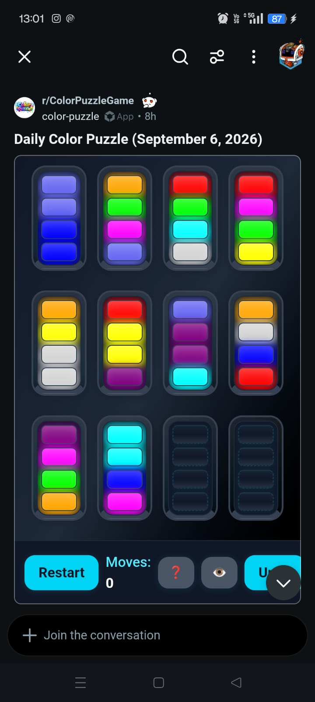

# Color Puzzle Solver

Upload a screenshot of the daily color-sorting puzzle and get the **fewest-move solution**, shown as an animated step-by-step replay.

**Use it online:** https://venkateshramesh178.github.io/colour-solver/



## What it does

1. **Reads the board from the screenshot** ([image_to_state.py](image_to_state.py))
   - Finds the cyan **Restart** button and uses it as an anchor point.
   - Samples the 48 slot positions (12 tubes × 4 slots) at fixed offsets from that anchor.
   - Treats dark slots as empty, then groups the filled slots into the game's 10 colors with k-means clustering.
2. **Solves it** ([solver.py](solver.py))
   - Runs an A* search with an admissible heuristic, so the answer is guaranteed to use the **minimum number of moves**.
   - Follows the game's rules: blocks pour from the bottom of a tube. A move takes the whole run of same-colored blocks at the bottom, as far as the destination has room.
3. **Shows the solution** ([visualize.py](visualize.py), [visualizer_template.html](visualizer_template.html))
   - Builds a self-contained HTML page that animates every move and lists them in order. [solution.html](solution.html) is an example.

| File | Purpose |
| --- | --- |
| `index.html` | The web page: drop, choose or paste a screenshot |
| `worker.js` | Runs the Python code in the browser via [Pyodide](https://pyodide.org) |
| `app.py` | Optional local web server for the page, plus a `/solve` API |
| `image_to_state.py` | Screenshot → board state (also a command-line tool) |
| `solver.py` | A* solver |
| `visualize.py` | Solution → animated HTML page |

## Using the website

1. Open https://venkateshramesh178.github.io/colour-solver/.
2. Wait for **"Solver ready."** The first visit downloads about 30 MB of Python packages, which can take a little while. Your browser caches them, so later visits are fast.
3. Drop a screenshot onto the box, click it to choose a file, or paste one with **Ctrl+V**.
4. The animated solution appears below the box.

Everything runs in your browser, and your screenshot is never uploaded anywhere.

## Running it on your own computer

You need **Python 3.10+** and Git.

```bash
git clone https://github.com/VenkateshRamesh178/colour-solver.git
cd colour-solver

python -m venv venv
# Windows:
venv\Scripts\activate
# macOS / Linux:
source venv/bin/activate

pip install -r requirements.txt
```

### Option A: the web page, locally

```bash
python app.py
```

Then open http://localhost:8000. This is the same page as the website, and the solver still runs in the browser. Use `--host` and `--port` to change the address, e.g. `python app.py --host 0.0.0.0 --port 8080` to reach it from other devices on your network.

`app.py` also exposes an HTTP API that solves with your local Python install:

```bash
curl --data-binary @color-puzzle.jpeg http://localhost:8000/solve
```

It returns JSON with `state`, `moves`, `expanded`, `seconds` and `html` (the solution page), or `error`.

### Option B: the command line

```bash
python image_to_state.py color-puzzle.jpeg
```

This prints the detected colors, the board, and the move list, then writes the animated solution to `solution.html`, which you can open in any browser. Use `--html other.html` to choose a different output file.

### Option C: from Python

```python
from image_to_state import image_to_state
from solver import from_screenshot_state, solve, format_solution
from visualize import export_html

state, palette, _, _ = image_to_state("color-puzzle.jpeg")
solution = solve(from_screenshot_state(state))
print(format_solution(solution))
export_html(solution, palette, "solution.html")
```

`solve()` also accepts a hand-written board: a list of tubes, each listed **bottom → top** with empty slots left out, e.g. `[(3, 3, 7, 7), (7, 7, 3, 3), ()]`.

## Screenshot requirements

The board reader uses fixed pixel offsets measured on [the example](color-puzzle.jpeg), so it expects screenshots of the same layout:

- Portrait, with the same aspect ratio as the example (9:20, e.g. 720 × 1600 or 1080 × 2400). Any resolution works: images are scaled to 720 pixels wide before reading, so resized or recompressed copies (from messaging apps, cloud photo apps, etc.) are fine.
- The game's 3 × 4 layout of 12 tubes, with the whole board and the cyan **Restart** button visible.
- 10 colors, 4 blocks each, 2 empty tubes.

Cropped screenshots or other layouts will fail with "Could not find the Restart button." (the message includes the image's size) or give a wrong board. To support them, adjust `SLOT_OFFSETS` and the search band in `find_restart_button()` in [image_to_state.py](image_to_state.py).

## Hosting your own copy on GitHub Pages

The site is plain static files, so you can host a fork as-is: go to **Settings → Pages**, choose **Deploy from a branch**, then select `main` and `/ (root)`.
